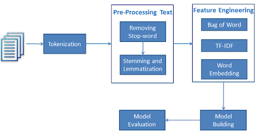
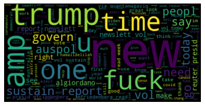
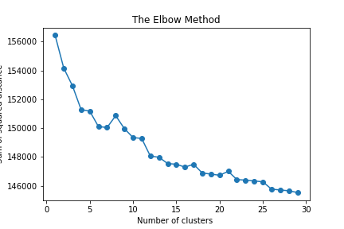
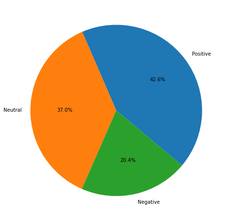

# Tweets-Analaysis-NLP

Goals :
* Master the twitter API for extracting tweets
* Master the NLP (natural language processing) part with NLTK in Python
* Apply the principles of data cleaning
* Classify tweets: group together tweets that are similar.


## Getting Started
first should be created twitter account,
you can consult the following links: 
* https://developer.twitter.com/en/docs/twitter-api 
* https://developer.twitter.com/en


## 1- Extraction twitter data (twwepy + pandas)
### * Importing owr libraries
### * Creating a twitter App
### * Tweets Extraction (11356 tweets)
### * Creating a DataFrame of each tweets then conctenate all the tweets and save in CSV file


## 2- processing tweets

### Drop Duplicates
### Cleaning tweets :
          * Remove Punctuation
          * Remove Emoji
          * Remove URLs
          * Converting all tweets to lower case
          * Remove Number
         

## 3-  Data Pre-Processing : NLP( Natural Languages Processsing)
#### NLTK is a powerful Python package that provides a set of diverse natural languages algorithms. It is free, opensource, easy to use, large community, and well documented. NLTK consists of the most common algorithms such as tokenizing, part-of-speech tagging, stemming, sentiment analysis, topic segmentation, and named entity recognition. NLTK helps the computer to analysis, preprocess, and understand the written text.
````
!pip install nltk
````



## Tokenization
#### Tokenization is the first step in text analytics. The process of breaking down a text paragraph into smaller chunks such as words or sentence is called Tokenization. Token is a single entity that is building blocks for sentence or paragraph.
 * Sentence Tokenization : Sentence tokenizer breaks text paragraph into sentences.
 * Word Tokenization : Word tokenizer breaks text paragraph into words.
 
## Stopwords

#### Stopwords considered as noise in the text. Text may contain stop words such as is, am, are, this, a, an, the, etc. In NLTK for removing stopwords, you need to create a list of stopwords and filter out your list of tokens from these words.

## Lexicon Normalization

#### Lexicon normalization considers another type of noise in the text. For example, connection, connected, connecting word reduce to a common word "connect". It reduces derivationally related forms of a word to a common root word.

### Stemming :
Stemming is a process of linguistic normalization, which reduces words to their word root word or chops off the derivational affixes. For example, connection, connected, connecting word reduce to a common word "connect".
### Lemmatization : 
Lemmatization reduces words to their base word, which is linguistically correct lemmas. It transforms root word with the use of vocabulary and morphological analysis. Lemmatization is usually more sophisticated than stemming. Stemmer works on an individual word without knowledge of the context. For example, The word "better" has "good" as its lemma. This thing will miss by stemming because it requires a dictionary look-up.

## 
 ### Create Dictionary refers to the frequency of this word in tweets (WordFrequency) 
 ### Get Max , Min , Mean occurance of word
 ### Create WordCloud
 
 ### Create the Bag Of Word Model (Vectorization)
  A bag-of-words model, or BoW for short, is a way of extracting features from text for use in modeling, such as with machine learning algorithms.

A bag-of-words is a representation of text that describes the occurrence of words within a document. It involves two things:

* A vocabulary of known words.
* A measure of the presence of known words.

It is called a “bag” of words, because any information about the order or structure of words in the document is discarded. The model is only concerned with whether known words occur in the document, not where in the document.


## 4- Modeling Using K-means Clustering
 Finding the optimal number of clusters using the elbow in the graph is called the Elbow method.
 
## 5- Visualization and basic statistic
## 6- Analysis Sentiments



